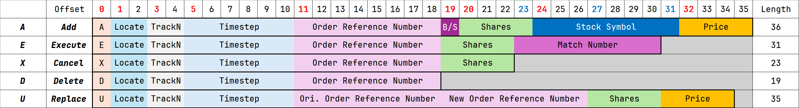
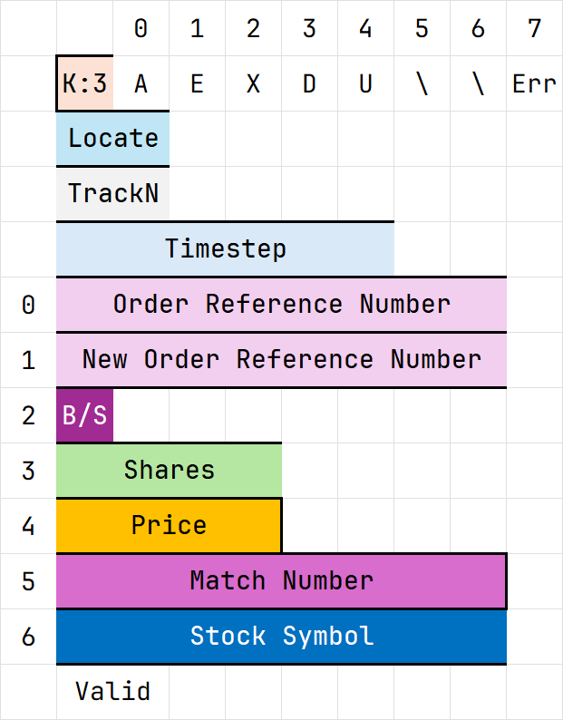

# ITCH LOB Parser

ITCH LOB Parser is a compact reference implementation of a simplified Nasdaq
ITCH order-lifecycle feed. The same generated binary stream is parsed by a
Python model, a C++23 module-based CLI, and a SystemVerilog RTL core so behavior
throughput can be compared directly.

## Quantifiable Results

### Protocol Slice

The project intentionally focuses on the messages that mutate a visible limit
order book: add, execute, cancel, delete, and replace. Inputs are fixed-length
ITCH payloads concatenated back-to-back; there is no SoupBinTCP, MoldUDP64,
stock-directory, trade, status, or admin framing.



### Benchmark Snapshot

`scripts/bench_parsers.py` generates one deterministic stream, runs all parser
implementations on it, and reports median software time plus idealized RTL
throughput from measured cycle counts.

```bash
uv run python scripts/bench_parsers.py --messages 10000 --repeat 5 --build-cpp
```

Example result run on a Windows 11 machine with AMD Ryzen AI 9 365:

- Dataset: `tmp\bench_stream.bin`
- Messages: 10000
- Bytes: 288000
- Repeats: 5

| Parser      | Time (median) |   MB/s |        Msg/s | Notes                           |
| ----------- | ------------: | -----: | -----------: | ------------------------------- |
| Python      |     0.035401s |   8.14 |   282,479.49 | ref_parser.parse_stream         |
| C++         |     0.001815s | 158.70 | 5,510,550.00 | ItchParser quiet mode           |
| rtl @100MHz | 298000 cycles |  96.64 | 3,355,704.70 | measured cycles, ideal hardware |
| rtl @250MHz | 298000 cycles | 241.61 | 8,389,261.74 | measured cycles, ideal hardware |

Local WSL/GCC toolchain check on the same 10,000-message, 288,000-byte
deterministic stream (`python3 scripts/gen_bench_stream.py --messages 10000
--out tmp/bench_stream.bin`, SHA256
`72c454a6562cbba07d51a7c6320b85ba551c179bf92564989b5387e24114829c`):

| Compiler | Time (median) |     MB/s |        Msg/s | Method                                      |
| -------- | ------------: | -------: | -----------: | ------------------------------------------- |
| GCC 13.3 |     0.000229s | 1,257.49 | 43,662,800.00 | header/C++20 baseline (pre-modules branch)  |
| GCC 16.1 |     0.000140s | 2,054.08 | 71,322,100.00 | header/C++20 baseline (pre-modules branch)  |
| GCC 16.1 |     0.000151s | 1,910.70 | 66,343,800.00 | C++23 modules, `build/itch_cli --bench`     |
| GCC 16.1 |     0.000209s | 1,375.48 | 47,759,825.00 | C++23 modules + `expected`/endian refactor  |

These local C++ runs are useful for compiler comparison, but the sub-millisecond
times show visible run-to-run noise and are not directly comparable to the
Windows reference machine above. The module build uses CMake `Release` defaults
for GNU C++ (`CMAKE_CXX_FLAGS_RELEASE=-O3 -DNDEBUG`) with C++23 and `import std`;
no `-march=native`, LTO, PGO, `-Ofast`, or other custom optimization flags were
enabled.

Use `--skip-rtl` to compare only the Python and C++ parsers.

## What Is Implemented

The simplified protocol is defined in `localref/simp_itch_spec.md`. All integer
fields are big-endian. `Timestamp` is a 6-byte unsigned integer representing
nanoseconds since midnight. `Price(4)` is a raw `uint32_t` fixed-point value
with four implied decimal places, so `1732500` represents `173.2500`. Stock
symbols are 8 ASCII bytes, left-aligned and padded with spaces.

### Message Types

| Type | Message        | Length | LOB meaning                                                                |
| ---- | -------------- | -----: | -------------------------------------------------------------------------- |
| `A`  | Add Order      |     36 | Insert a new visible order.                                                |
| `E`  | Order Executed |     31 | Reduce an existing order by executed shares.                               |
| `X`  | Order Cancel   |     23 | Reduce an existing order by cancelled shares.                              |
| `D`  | Order Delete   |     19 | Remove an existing order completely.                                       |
| `U`  | Order Replace  |     35 | Remove an old order ref and insert a new order ref with updated qty/price. |

Every message begins with the same 11-byte header:

| Offset | Length | Field           |
| -----: | -----: | --------------- |
|      0 |      1 | Message type    |
|      1 |      2 | Stock locate    |
|      3 |      2 | Tracking number |
|      5 |      6 | Timestamp       |

Message-specific payload fields are laid out at fixed offsets from the start of
the message:

| Type | Extra fields                                                                                 |
| ---- | -------------------------------------------------------------------------------------------- |
| `A`  | `11: order_ref u64`, `19: side char`, `20: shares u32`, `24: stock char[8]`, `32: price u32` |
| `E`  | `11: order_ref u64`, `19: executed_shares u32`, `23: match_number u64`                       |
| `X`  | `11: order_ref u64`, `19: cancelled_shares u32`                                              |
| `D`  | `11: order_ref u64`                                                                          |
| `U`  | `11: original_order_ref u64`, `19: new_order_ref u64`, `27: shares u32`, `31: price u32`     |

### Normalized Event Model

All parsers normalize binary messages into the same event shape: `kind`,
`stock_locate`, `tracking_number`, `timestamp`, `order_ref`, `new_order_ref`,
`side`, `qty`, `price`, `match_number`, `stock`, and `valid_mask`. The valid
mask records which payload fields are meaningful for each event kind.

<p align="center">
  
</p>

| Event     | Valid payload fields                         |
| --------- | -------------------------------------------- |
| `ADD`     | `order_ref`, `side`, `qty`, `price`, `stock` |
| `EXECUTE` | `order_ref`, `qty`, `match_number`           |
| `CANCEL`  | `order_ref`, `qty`                           |
| `DELETE`  | `order_ref`                                  |
| `REPLACE` | `order_ref`, `new_order_ref`, `qty`, `price` |

### Order Lifecycle Rules

- `ADD`: require `order_ref` is new, `side` is `B` or `S`, and `qty > 0`; insert
  the order at its raw `Price(4)` value.
- `EXECUTE`: require `order_ref` exists and executed shares do not exceed the
  remaining quantity; subtract `qty`, erasing the order when it reaches zero.
  The execution message has no price, so book maintenance uses the stored price
  from the original order.
- `CANCEL`: same quantity-reduction rule as execute, but for cancelled shares.
- `DELETE`: require `order_ref` exists; remove all remaining quantity and erase
  the order.
- `REPLACE`: require the original `order_ref` exists and `new_order_ref` is not
  already active; remove the original order and insert `new_order_ref` with the
  old side, old stock, old locate, new quantity, and new price.

## Project Layout

- `scripts/packet_gen.py`: binary packet and deterministic stream generator.
- `scripts/ref_parser.py`: Python reference parser and tiny order book model.
- `cpp/`: C++23 named-module parser library (`itch.spec`, `itch.parser`,
  `itch.lob`, umbrella `itch`) plus `itch_cli` for smoke tests and benchmarks.
- `rtl/`: SystemVerilog parser cores and shared protocol package.
- `scripts/cocotb/`: cocotb/Verilator validation and RTL benchmark harness.
- `scripts/vivado/`: optional Vivado xsim, synthesis, and post-synthesis
  simulation utilities.
- `scripts/bench_parsers.py`: combined Python, C++, and RTL benchmark runner.

## Setup

Use `uv` for the Python environment on both Linux and Windows:

```bash
uv sync
```

### Linux

The original flow assumes these tools are available on `PATH`:

- `uv`
- `cmake` 3.30 or newer (CMake 4.x via `uv tool install cmake` works well for
  experimental `import std` support)
- `ninja`
- GCC 16.1 with suffixed binaries such as `g++-16.1` (see C++ CLI below)
- `make`
- `verilator`

### Windows

The Windows flow uses MSVC for both the C++ CLI and the cocotb Verilator runner.
Install these tools and make sure `uv`, `cmake`, and `verilator` are on `PATH`:

- `uv`
- `cmake`
- Verilator for Windows, tested with [withlimon/verilator-windows](https://github.com/withlimon/verilator-windows)
- MSVC Build Tools or Visual Studio with the C++ toolchain

Run Windows build, RTL, and benchmark commands from an MSVC environment:

```bat
cmd /c "call <MSVC Installation Path>\VC\Auxiliary\Build\vcvarsall.bat x64 && <command>"
```

### Vivado xsim (Optional)

The Vivado flow is separate from the default cocotb/Verilator path. Use it when
you want AMD Vivado Simulator smoke tests, cycle-count benchmarks, or
out-of-context synthesis reports. Make sure these Vivado commands are on
`PATH`:

- `vivado`
- `xvlog`
- `xelab`
- `xsim`

Vivado is not required for the Python, C++, or cocotb/Verilator commands above.

## Build, Test, And Benchmark

### Python Reference

Run the unit tests:

```bash
uv run python -m unittest discover -s tests -p "test_*.py"
```

Generate and parse packets from Python:

```python
from scripts import packet_gen, ref_parser

stream = packet_gen.gen_stream([
    packet_gen.gen_add(1, 1, 100, 1001, "B", 100, "AAPL", 1_000_000),
    packet_gen.gen_cancel(1, 2, 101, 1001, 40),
])

events = ref_parser.parse_stream(stream)
lob = ref_parser.TinyLob()
lob.apply_all(events)

assert lob.orders[1001].qty == 60
```

For deterministic test data, use `PacketGenerator`, which auto-increments
tracking numbers and timestamps:

```python
gen = packet_gen.PacketGenerator(locate=1, timestamp=100)
order_ref, add = gen.add(side="B", shares=100, stockSymbol="AAPL", price=1_000_000)
exe = gen.execute(order_ref, shares=25)
```

### C++ CLI

The C++ stack is a C++23 named-module experiment: module interfaces live in
`cpp/*.cppm`, implementation units in `cpp/*.cpp`, and the CLI uses
`import std; import itch;`. The parser API is:

```cpp
std::expected<std::vector<ItchEvent>, ParseErr> start(std::span<const std::byte> bytes);
```

`ParseErr` carries `kind`, `offset`, and `message` for malformed streams.
Integer fields are read with big-endian helpers built on `std::memcpy` and
`std::byteswap`. GCC 16.1 plus Ninja is the supported Linux build path on this
branch.

Linux (GCC 16.1):

```bash
source ~/env-gcc16.sh
export PATH="$HOME/.local/bin:$PATH"   # if using `uv tool install cmake`
cmake -S . -B build -G Ninja -DCMAKE_BUILD_TYPE=Release \
  -DCMAKE_CXX_COMPILER=g++-16.1
cmake --build build
uv run python scripts/gen_cpp_parser_fixtures.py
./build/itch_cli scripts/data/smoke_all_types.bin
./build/itch_cli scripts/data/max_width_add.bin
```

`~/env-gcc16.sh` prepends `$HOME/opt/gcc-16.1.0/bin` to `PATH`. The compiler
binaries are version-suffixed (`gcc-16.1`, `g++-16.1`), so pass
`-DCMAKE_CXX_COMPILER=g++-16.1` explicitly.

Windows:

The module refactor is validated on Linux with GCC 16.1. MSVC module support may
work with Visual Studio 2022 17.4+ and Ninja, but it is not the primary path on
this branch.

### RTL Cocotb Flow

Linux:

```bash
uv run make -C scripts/cocotb
```

Windows:

```bat
cmd /c "call <MSVC Installation Path>\VC\Auxiliary\Build\vcvarsall.bat x64 && uv run make -C scripts/cocotb"
```

On Windows, `uv run make` is a project shim that invokes
`scripts/cocotb/run_verilator.py`; it still accepts Makefile-style environment
overrides such as `COCOTB_TEST_MODULES=bench_itch_parser_core`.

### RTL Vivado xsim Flow

The optional Vivado flow uses a native SystemVerilog testbench,
`rtl/tb_itch_parser_core_xsim.sv`, plus vector files generated from the same
Python packet generator and reference parser. Generated Vivado files are written
under `tmp/`.

Run a pre-synthesis functional smoke test:

```bash
uv run python scripts/vivado/run_xsim.py --messages 100 --mode verify
```

Run a pre-synthesis cycle-count benchmark:

```bash
uv run python scripts/vivado/run_xsim.py --messages 10000 --mode bench --clock-mhz 100,250
```

Example xsim benchmark result from this machine:

```text
PASS: xsim accepted 288000 bytes, emitted 10000 events in 298000 cycles

| Parser | Cycles | MB/s | Msg/s | Notes |
|---|---:|---:|---:|---|
| xsim @100MHz | 298000 | 96.64 | 3,355,704.70 | pre-synthesis simulation, ideal hardware |
| xsim @250MHz | 298000 | 241.61 | 8,389,261.74 | pre-synthesis simulation, ideal hardware |
```

### Post-Synthesis Vivado Flow

Run out-of-context synthesis for a specific Vivado part and clock target:

```bash
uv run python scripts/vivado/run_synth.py --part xc7a35tcpg236-1 --clock-mhz 250
```

Then run the same xsim testbench against the synthesized functional netlist:

```bash
uv run python scripts/vivado/run_post_synth_xsim.py --messages 100 --mode verify
```

The synthesis wrapper writes `timing_summary.rpt`, `utilization.rpt`, a DCP,
and `itch_parser_core_synth.v` under `tmp/vivado_synth/`. The post-synthesis
xsim run is a functional netlist check; use the reports for timing and resource
data.

### Combined Benchmark

Linux:

```bash
uv run python scripts/bench_parsers.py --messages 10000 --repeat 5 --build-cpp
```

Windows:

```bat
cmd /c "call <MSVC Installation Path>\VC\Auxiliary\Build\vcvarsall.bat x64 && uv run python scripts/bench_parsers.py --messages 10000 --repeat 5 --build-cpp"
```

The RTL rows in this combined benchmark continue to use cocotb/Verilator cycle
counts. Vivado xsim benchmarks are available through `scripts/vivado/run_xsim.py`
as a separate optional flow.

### Profiling Breakdown

Use the profiling scripts when you want stage-level detail instead of only the
headline benchmark table. The profiling flow is WSL-friendly and uses the same
deterministic packet generator as the benchmark.

Prerequisites:

- Required: `uv`, Python 3.12+, CMake 3.30+, Ninja, GCC 16.1 (`g++-16.1`), and
  `make`.
- Required for RTL profiling: `verilator`.
- Optional for C++ callgraph profiling: `valgrind`. This WSL environment was
  checked with `valgrind-3.22.0`.
- Not required: Vivado, `xsim`, or synthesis tools.

Profile only the Python parser:

```bash
uv run python scripts/profile_python_parser.py --messages 10000 --repeat 5
```

Build C++ and run the C++ breakdown profiler against an existing stream:

```bash
cmake -S . -B build -DCMAKE_BUILD_TYPE=Release
cmake --build build
./build/itch_cli --bench-breakdown --json --repeat 5 tmp/bench_stream.bin
```

Run the combined Python, C++, and RTL profiler:

```bash
uv run python scripts/profile_parsers.py --messages 10000 --repeat 5 --build-cpp
```

Run C++ Callgrind profiling and write `tmp/profile/callgrind.out`:

```bash
uv run python scripts/profile_parsers.py --messages 10000 --repeat 1 --build-cpp --skip-rtl --run-callgrind
```

Example profiling result from this WSL environment:

```text
Dataset: /home/chesi/itch_lob_parser/tmp/profile/bench_stream.bin
Messages: 10000
Bytes: 288000
Repeats: 5

| Parser/stage | Median time | MB/s | Msg/s | Notes |
|---|---:|---:|---:|---|
| Python parse | 0.034053s | 8.46 | 293,657.84 | ref_parser.parse_stream |
| C++ parse | 0.000272s | 1,057.39 | 36,714,900.00 | ItchParser::start |
| RTL cycles | 298000 cycles | N/A | N/A | cocotb/Verilator measured cycles |
```

The same run wrote `tmp/profile/profile.json`. Its RTL breakdown reported
`288000` read cycles, `10000` output cycles, `9999` input-stall cycles from
the one-cycle output handoff between messages, and per-type first-byte-to-event
latencies of `37` cycles for ADD, `32` for EXECUTE, `24` for CANCEL, `20` for
DELETE, and `36` for REPLACE. A separate Callgrind pass wrote
`tmp/profile/callgrind.out` and collected `7,600,559` instruction references.

## RTL Core Variants

All RTL variants expose the same normalized event interface, but the default
cocotb workflow selects `rtl/itch_parser_core.sv`.

- `rtl/itch_parser_core_legacy.sv` keeps the first working parser
  microarchitecture. It decodes fields with direct byte-offset `case`
  statements and serves as a simple baseline.
- `rtl/itch_parser_core_layout.sv` is the middle-ground refactor with named
  layout constants, helper functions, and packed normalized event state.
- `rtl/itch_parser_core.sv` is the maintained parser core. It uses a static
  microcoded field table from `rtl/itch_parser_pkg.sv` to map byte offsets to
  normalized event fields while preserving the same external behavior.

All variants share the same external event interface, but the default cocotb and
Vivado flows target `rtl/itch_parser_core.sv`.
